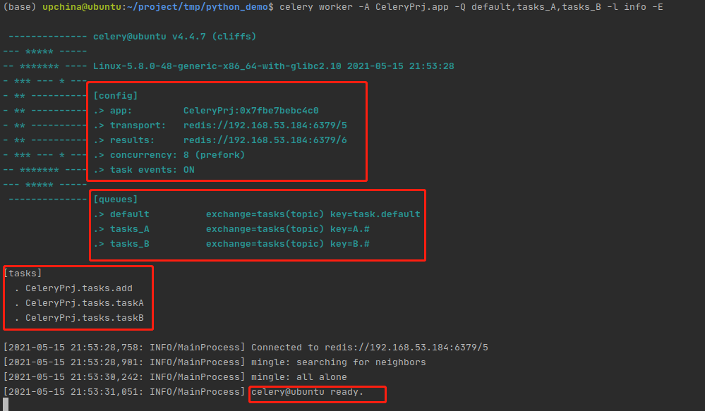
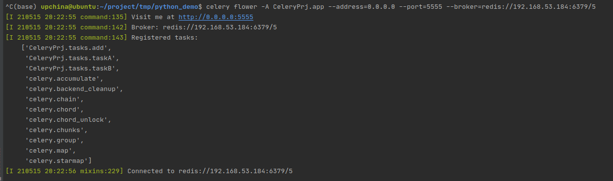
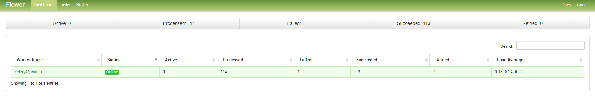
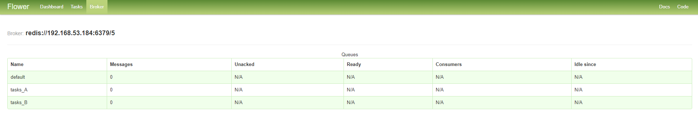
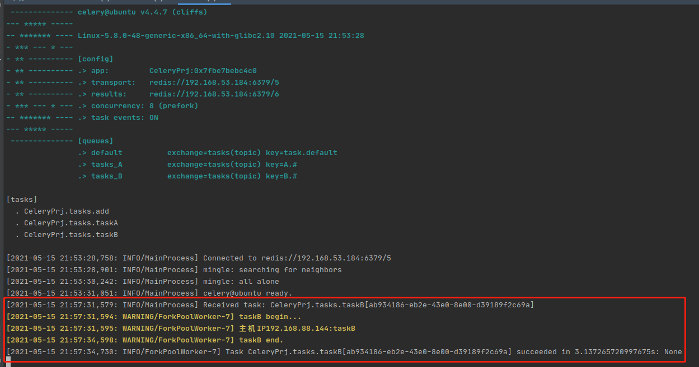

# 1. Celery 简介

Celery是一个自带电池的基于Python开发的分布式异步任务队列，分布式决定了可以有多个 worker 的存在，队列表示其是异步操作，即存在一个产生任务提出需求的工头，和一群等着被分配工作的码农。它非常易于使用，通过它可以轻松的实现任务的异步处理， 如果你的业务场景中需要用到异步任务，就可以考虑使用Celery。它主要适用于两大类场景：

- 异步：
     有的任务执行时间较长，你不想让程序一直等待结果返回，可以先将改任务放入celery任务队列中，并从Celery获取一个任务ID。后续通过询问Celery来得知任务执行状态和进度。

- 定时：
     需要定时执行同样的任务，Celery任务队列支持定时触发，可以按照时间间隔或者crontab表达式来触发任务。

在 Python 中定义 Celery 的时候，我们要引入 Broker，中文翻译过来就是“经纪人”的意思，在这里 Broker 起到一个中间人的角色。在工头提出任务的时候，把所有的任务放到 Broker 里面，在 Broker 的另外一头，一群码农等着取出一个个任务准备着手做。这种模式注定了整个系统会是个开环系统，工头对于码农们把任务做的怎样是不知情的。所以我们要引入 Backend 来保存每次任务的结果。这个 Backend 有点像我们的 Broker，也是存储任务的信息用的，只不过这里存的是那些任务的返回结果。我们可以选择只让错误执行的任务返回结果到 Backend，这样我们取回结果，便可以知道有多少任务执行失败了。


Celery具有以下优点：

- 简单
    Celery 使用和维护都非常简单，并且不需要配置文件。交流论坛：一个[mailing-list](https://groups.google.com/group/celery-users) 和一个[IRC channel](http://docs.celeryproject.org/en/latest/getting-started/resources.html#irc-channel).

- 高可用
    woker和client会在网络连接丢失或者失败时，自动进行重试。并且有的brokers 也支持“双主”或者“主／从”的方式实现高可用。
- 快速
    单个的Celery进程每分钟可以处理百万级的任务，并且只需要毫秒级的往返延迟（使用 RabbitMQ, librabbitmq, redis和优化设置时）
- 灵活
    Celery几乎每个部分都可以扩展使用，自定义池实现、序列化、压缩方案、日志记录、调度器、消费者、生产者、broker传输等等。


这有一个最简单的应用示例，你可以参照：

```python
from celery import Celery

broker = 'redis://192.168.53.184:6379/5'
backend = 'redis://192.168.53.184:6379/6'

app = Celery('tasks', broker=broker, backend=backend)

@app.task
def hello():
    return 'hello world'

if __name__ == "__main__":
    hello()
```


# 2.Celery工作流程


# 3. Celery安装

你可以安装Celery通过Python包管理平台（PyPI）或者源码安装
 使用pip安装:

```ruby
$ pip install celery==5.0.5
```


# 4. Celery使用

## 4.1 Brokers

Celery支持多种消息中间件作为Broker，即中间人。来在应用程序和Worker之间传递消息。

**支持的消息中间件总览：**

| 消息中间件 | 支持适配状态 | 支持监控 | 支持远程控制 |
| ---------- | ------------ | -------- | ------------ |
| RabbitMQ   | 稳定         | 是       | 是           |
| Redis      | 稳定         | 是       | 是           |
| Amazon SQS | 稳定         | 否       | 否           |
| Zookeeper  | 实验         | 否       | 否           |

RabbitMQ是默认的Broker它不需要其他额外的依赖和初始化配置。


```python
BROKER_URL = "redis://192.168.53.184:6379/5"
```


## 4.2 Backend

通常程序发送的消息，发完就完了，可能都不知道对方时候接受了。为此，celery实现了一个backend，用于存储这些消息以及celery执行的一些消息和结果。Backend是在Celery的配置中的一个配置项 CELERY_RESULT_BACKEND ，作用是保存结果和状态，如果你需要跟踪任务的状态，那么需要设置这一项，可以是Database backend，也可以是Cache backend 。

对于 brokers，官方推荐是 rabbitmq 和 redis，至于 backend，就是数据库。为了简单可以都使用 redis。

```python
CELERY_RESULT_BACKEND = "redis://192.168.53.184:6379/6"
```


## 4.3 Woker

Worker是Celery提供的任务执行的单元，worker并发的运行在分布式的系统节点中。

```shell
celery worker -A tasks --loglevel=info

#一次启动多个worker
celery -A CeleryProject.app worker -Q default,tasks_A,tasks_B -l info -E
```



## 4.4 Beat

 Celery通过celery beat进程来完成定时任务。Celery beat启动之后, 读取配置文件中的定时任务信息，到了需要执行时间点, 消费者Celery beat便将其加入到queue中， worker进程拿来消费。为了避免有重复的任务被发送出去，所以Celery beat仅能有一个。

定时任务配置的其中一种方式：

```python
CELERYBEAT_SCHEDULE = {
    "add":{
        "task":"CeleryProject.tasks.add",
        "schedule":timedelta(seconds=10),   #每10s执行一次
        "args":(10,16)
    },
    "taskA":{
        "task": "CeleryProject.tasks.taskA",
        "schedule": crontab(minute="*/1")   #每1min执行一次
    },
    "taskB":{
        "task": "CeleryProject.tasks.taskB",
        "schedule": crontab(minute="*/1")   #每1min执行一次
    }
}
```

启动celery beat

```shell
celery beat -A CeleryProject.app -l info
```


## 4.5路由配置

celery beat生成任务消息，然后发送到exchange（交换机），交换机决定哪个队列接收这个消息，这个就需要配置交换机的路由key。

三种交换类型：

* Direct Exchange
    * 直接交换，也就是指定一个队里来接收，这个消息被celerybeat发送给指定的routekey所绑定的队列。
* Topic Exchange
    * Topic可以根据同类的属性进程通配。例如，你有三个队列和三个消息, A消息可能希望被X,Y处理,B消息你希望被,X,Z处理,C消息你希望被Y,Z处理.并且这个不是队列的不同而是消息希望被相关的队列都去执行
* Fanout Exchange
    * Fanout类型的消息在生成的时候为多份,每个队列一份，相当于是广播

```python
CELERY_QUEUES = {
    Queue("default", routing_key="task.default"),  # 路由键以task开头的信息都进入到default队列中
    Queue("tasks_A", routing_key="A.#"),  # 路由键以A开头的信息都进入到task_A队列中
    Queue("tasks_B", routing_key="B.#")  # 路由键以B开头的信息都进入到task_B队列中
}

CELERY_DEFAULT_QUEUE = "default"
CELERY_DEFAULT_EXCHANGE = "tasks"
CELERY_DEFAULT_EXCHANGE_TYPE = "topic"
CELERY_DEFAULT_ROUTING_KEY = "task.default"

CELERY_ROUTES = (
    {
        re.compile(r"CeleryProject\.tasks\.(taskA|taskB)"): {"queue": "tasks_A", "routing_key": "A.import"}
    },
    {
        "CeleryProject.tasks.add": {"queue": "default", "routing_key": "task.default"}
    }
)
```


# 5.celery flower安装

```shell
pip install flower

#启动celery flower
celery flower -A CeleryProject.app --address=0.0.0.0 --port=5555 --broker=redis://192.168.53.184:6379/5

#通过post请求向celery worker 发送异步任务请求
curl -X POST -d '{"args":[122,18]}' http://localhost:5555/api/task/send-task/tasks.add
```



celery flower启动之后可以访问web界面：









# 6.完整celery项目代码

[项目地址](https://github.com/CCPig/CeleryProject.git)

项目结构：

```shell
(base) upchina@ubuntu:~/project/tmp/python_demo/CeleryProject$ tree
.
├── app.py				#celery应用
├── __init__.py			#Celery项目包，空文件
├── settings.py         #应用配置及任务配置
└── tasks.py			#任务模块

0 directories, 4 files
```


app.py

```python
#!/usr/bin/env python
# encoding: utf-8
"""
@author: chaochen
@file: app.py
@time: 2021/5/15 下午3:42
"""
from celery import Celery
app = Celery("CeleryProject", include=["CeleryProject.tasks"])
app.config_from_object("CeleryProject.settings")


if __name__ == "__main__":
    app.start()
    pass
```


tasks.py

```python
#!/usr/bin/env python
# encoding: utf-8
"""
@author: chaochen
@file: tasks.py
@time: 2021/5/15 下午4:02
"""

import os
import time
import socket
from CeleryProject.app import app

def get_host_ip():
    """
    查询worker节点的ip
    :return: ip
    """
    try:
        s = socket.socket(socket.AF_INET, socket.SOCK_DGRAM)
        s.connect(("8.8.8.8", 80))
        ip = s.getsockname()[0]
    finally:
        s.close()
    return ip

@app.task
def add(x, y):
    s = x + y
    time.sleep(3)
    print("主机IP{}:x + y = {}".format(get_host_ip(), s))
    return s

@app.task
def taskA():
    print("taskA begin...")
    print("主机IP{}:taskA".format(get_host_ip()))
    time.sleep(3)
    print("taskA end.")


@app.task
def taskB():
    print("taskB begin...")
    print("主机IP{}:taskB".format(get_host_ip()))
    time.sleep(3)
    print("taskB end.")


if __name__ == "__main__":
    print(get_host_ip())
    taskA()
    pass
```


settings.py

```python
#!/usr/bin/env python
# encoding: utf-8
"""
@author: chaochen
@file: settings.py
@time: 2021/5/15 下午3:45
"""
from celery.schedules import crontab
from kombu import Queue
import re
from datetime import timedelta

CELERY_QUEUES = {
    Queue("default", routing_key="task.default"),  # 路由键以task开头的信息都进入到default队列中
    Queue("tasks_A", routing_key="A.#"),  # 路由键以A开头的信息都进入到task_A队列中
    Queue("tasks_B", routing_key="B.#")  # 路由键以B开头的信息都进入到task_B队列中
}

CELERY_DEFAULT_QUEUE = "default"
CELERY_DEFAULT_EXCHANGE = "tasks"
CELERY_DEFAULT_EXCHANGE_TYPE = "topic"
CELERY_DEFAULT_ROUTING_KEY = "task.default"

CELERY_ROUTES = (
    {
        re.compile(r"CeleryProject\.tasks\.(taskA|taskB)"): {"queue": "tasks_A", "routing_key": "A.import"}
    },
    {
        "CeleryProject.tasks.add": {"queue": "default", "routing_key": "task.default"}
    }
)

BROKER_URL = "redis://192.168.53.184:6379/5"
CELERY_RESULT_BACKEND = "redis://192.168.53.184:6379/6"
CELERY_RESULT_SERIALIZER = "json"
CELERY_TIMEZONE = "Asia/Shanghai"
CELERY_ACCEPT_CONTENT = ['json']

CELERYBEAT_SCHEDULE = {
    "add":{
        "task":"CeleryProject.tasks.add",
        "schedule":timedelta(seconds=10),   #每10s执行一次
        "args":(10,16)
    },
    "taskA":{
        "task": "CeleryProject.tasks.taskA",
        "schedule": crontab(minute="*/1")   #每1min执行一次
    },
    "taskB":{
        "task": "CeleryProject.tasks.taskB",
        "schedule": crontab(minute="*/1")   #每1min执行一次
    }
}

if __name__ == "__main__":
    pass

```

# 7.Celery API

# 8.参考链接：

[celery官方文档]([Celery - Distributed Task Queue — Celery 5.0.5 documentation (celeryproject.org)](https://docs.celeryproject.org/en/stable/))

[Python 并行分布式框架 Celery 详解_cuomer的博客-CSDN博客_celer](https://blog.csdn.net/cuomer/article/details/81214438)

[RabbitMQ的Python客户端pika使用调研](https://www.jianshu.com/p/594f609495a0)

[CeleryProject](https://github.com/CCPig/CeleryProject.git)


